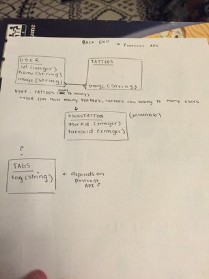

# project-two

**Technologies used**
* html/css 
* Node
* Express 
* Sequeilze 
* Bootstrap

**Approach taken**
* Wireframed 
* Consumed an external API (pinterest API)
* Set up routes/views
* Wrote functionality between routes
* Styled using html/css

**Unsolved problems** 
* I used a waterfall method to collect the images from the pinterest API. This makes my app run very slowly and causes my app to crash sporadically without warning. To fix this in the future, I would like to import the images into a database to fix those two problems.
* I would also like to add a feature for adding tags to the images so users can tag images. 
* I also want to allow the user to delete their account if they choose.

**User stories** 
* As a user I want to browse typography to gain inspiration for future typography projects.
* As a user I want to save typography images to my account.
* As a user I want to edit my account and delete pictures I am no longer using. 

